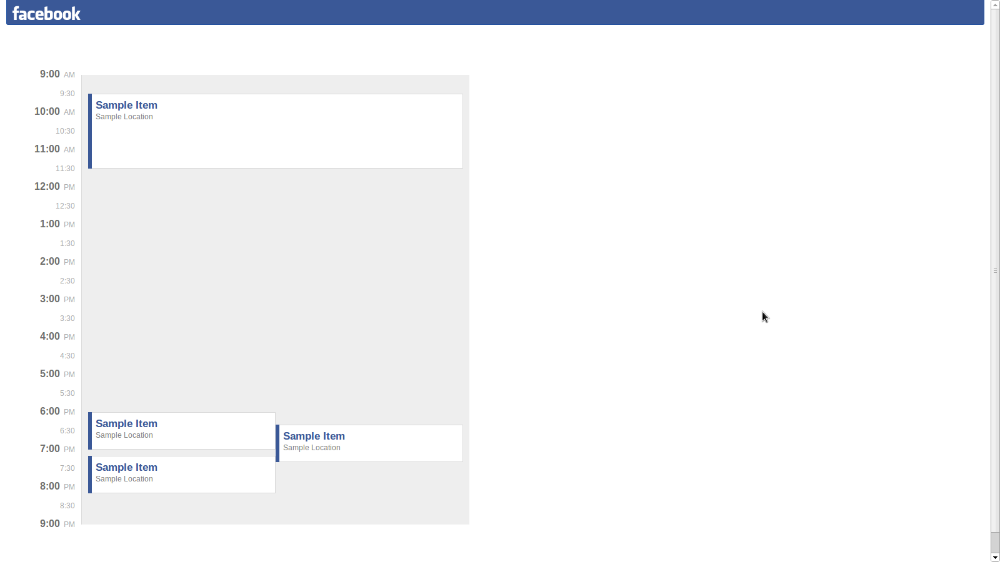

# fb
A tidy calendar.



## Installation
With [node](nodejs.org) installed:

````
npm i && bower install && npm i -g gulp && gulp
````

## Usage
Open with a static file server such as [httpster](https://github.com/SimbCo/httpster).
From the browser console run `window.layOutDay();` with an array of events as argument.

## Directory structure
````
.
├── build/         // Compiled files
├── docs/
├── client/        // Source files
│   ├── fonts/
│   ├── images/
│   ├── modules/
│   ├── styles/
│   └── vendor/    // Bower packages
├── node_modules/  // Node packages
└── test/
````

## License
© [Yoshua Wuyts](yoshuawuyts.com)